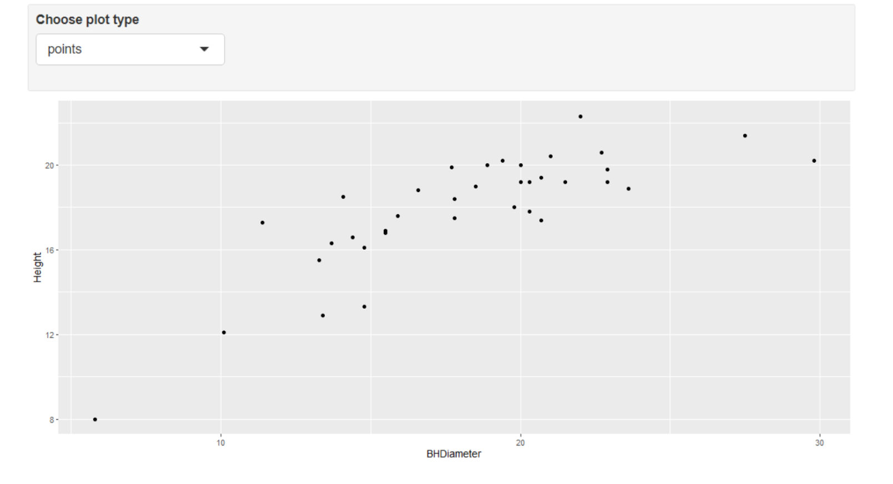
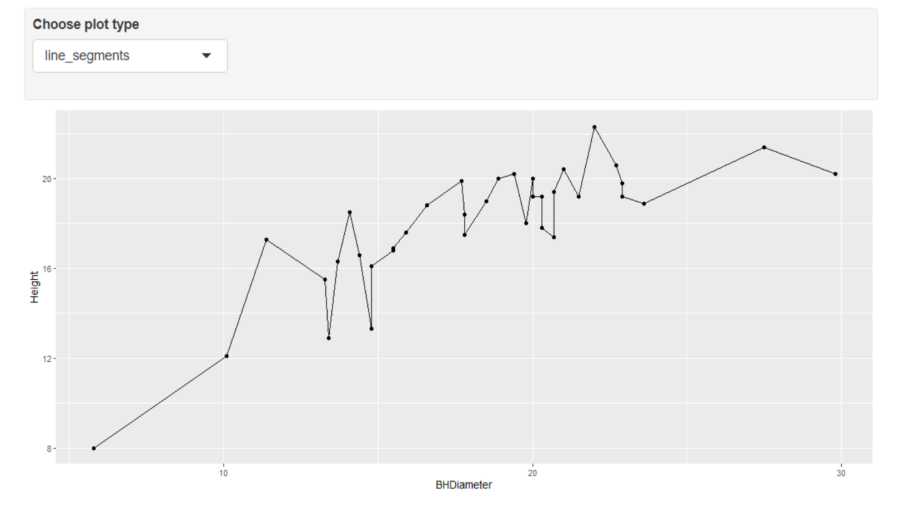
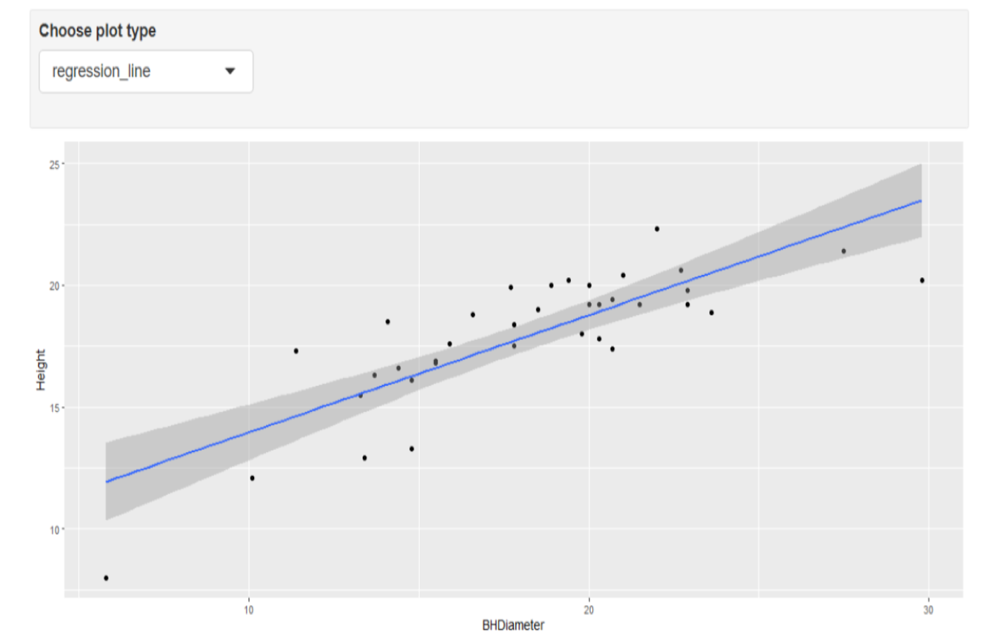

```{r setup, include=FALSE}
knitr::opts_chunk$set(echo = TRUE)
```

# Tasks

## Task 1
```{r}
getwd()
```

## Task 2
```{r}
spruce <- read.csv("SPRUCE.csv")
head(spruce)
```

## Task 3
Part 1: Scatter Plot

```{r}
plot(Height~BHDiameter, bg="blue", pch=21,cex=1.2, ylim = c(0,1.1*max(Height)), xlim =c(0,1.1*max(BHDiameter)), main="Height of Spruce trees vs. Breast Height Diameter", data=spruce)
```

It appears that there is no straight line relationship. It seems to be more of an exponential relationship than a straight line relationship.

Part 2:
```{r}
library(s20x)
layout(matrix(1:3,nr=3,nc=1))
trendscatter(Height~BHDiameter,f=0.5, data=spruce)
trendscatter(Height~BHDiameter,f=0.6, data=spruce)
trendscatter(Height~BHDiameter,f=0.7, data=spruce)
```

Part 3:
Linear Model Object
```{r}
spruce.lm = lm(Height~BHDiameter, data = spruce)
summary(spruce.lm)
```

```{r}
plot(Height~BHDiameter, data = spruce)
abline(spruce.lm)
```

Looking at the graph, the straight line is not appropriate as it does not represent the relationship between Height and BHDiameter in a strong way, and that can be seen from the R-squared value obtained from the summary function. However, when considering the curve line, it can be seen that the line includes more points and has a stronger representation of the relationship between the Height and BHDiameter variables.

## Task 4
```{r}
layout(matrix(1:4,nr=2,nc=2,byrow=TRUE))


#Plot the data
with(spruce, 
plot(Height~BHDiameter,bg="Blue",pch=21,ylim=c(0,1.1*max(Height)),xlim=c(0,1.1*max(BHDiameter)), main="Fitted Linear Line")
)

# make a linear model
spruce.lm=with(spruce, lm(Height~BHDiameter)) 

#plot a least squares regression line
abline(spruce.lm)

#make a new plot
with(spruce, 
plot(Height~BHDiameter,bg="Blue",pch=21,ylim=c(0,1.1*max(Height)),xlim=c(0,1.1*max(BHDiameter)), main="RSS")
)

#make yhat the estimates of E[Height | BHDiameter]
yhat=with(spruce,predict(spruce.lm,data.frame(BHDiameter)))
#OR you could use -- (yhat values the predicted values for all the BHDiameter values )
yhat=fitted(spruce.lm)

# Draw in segments making the residuals (regression deviations)
with(spruce,
segments(BHDiameter,Height,BHDiameter,yhat)
)
abline(spruce.lm)

#make a new plot
with(spruce, 
plot(Height~BHDiameter,bg="Blue",pch=21,ylim=c(0,1.1*max(Height)),xlim=c(0,1.1*max(BHDiameter)), main="MSS")
)

#make nieve model
with(spruce, 
abline(h=mean(Height)),col="Red"
)
abline(spruce.lm)

#make the explained deviations (explained by the model)
with(spruce, segments(BHDiameter,mean(Height),BHDiameter,yhat,col="Red"))

with(spruce, 
plot(Height~BHDiameter,bg="Blue",pch=21,ylim=c(0,1.1*max(Height)),xlim=c(0,1.1*max(BHDiameter)), main="TSS")
)
with(spruce,abline(h=mean(Height)))
with(spruce, segments(BHDiameter,Height,BHDiameter,mean(Height),col="Green"))
```

Calculations:
```{r}
RSS=with(spruce,sum((Height-yhat)^2))
RSS

MSS=with(spruce,sum((yhat-mean(Height))^2))
MSS

TSS=with(spruce,sum((Height-mean(Height))^2))
TSS
```

```{r}
MSS/TSS
```

MSS/TSS gives the same value as that of the R-squared. That means that MSS/TSS is the coefficient of determination. It shows how much the Height variable is affected by the BHDiameter variable. In other words, MSS/TSS shows the extent of variance of the Height variable that is influenced by the BHDiameter variable.

```{r}
TSS
MSS+RSS
```

TSS does equal the sum of RSS and MSS, i.e. TSS = MSS + RSS

## Task 5
```{r}
summary(spruce.lm)
```

```{r}
coef(spruce.lm)
```

The value of the slope is 0.4814743

The value of the intercept is 9.1468390

The equation of the fitted line is y = 0.48147x + 9.14684

Predicting the height of the spruce:
```{r}
new_spruce <- data.frame(
  BHDiameter = c(15,18,20)
)
predict(spruce.lm, newdata = new_spruce)
```

Therefore, the predictions for the height of the spruce when the diameter is 15,18 and 20 are 16.36895, 17.81338 and 18.77632 respectively.

## Task 6
```{r}
library(ggplot2)
s <- ggplot(spruce.lm, aes(x=BHDiameter, y=Height, col = BHDiameter)) + geom_point() + geom_line() + geom_smooth(method = "loess") + ggtitle("Height vs. Diameter")
s
```

## Task 7

{ width=70% }

{ width=70% }

{ width=70% }
